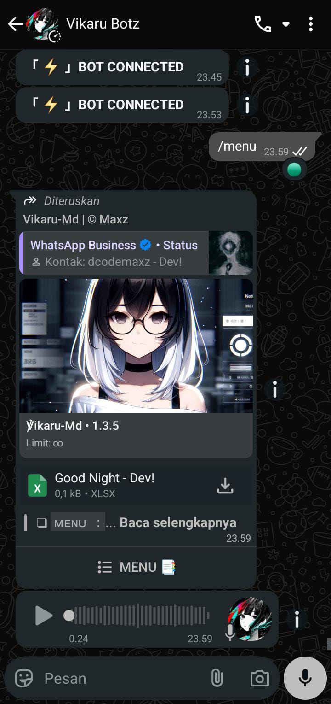
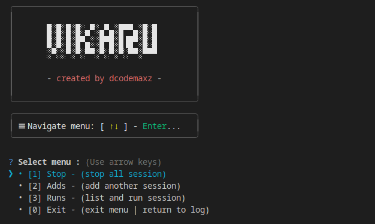

> Translate ( Indonesian )

Jika Anda menggunakan browser Chrome, ketuk titik tiga di sudut kanan atas untuk opsi "Terjemahkan..."

---

# <div align='center'>Vikaru-Md | WhatsApp Bot Multidevice</div>

<div align="center">


<br/>

<a href="https://chat.whatsapp.com/GlNdk54lm9V7C4U54SXnh1">
    
</a>

<a href="https://github.com/dcodemaxz/Vikaru-Bot/stargazers">
    
</a>
<a href="https://github.com/dcodemaxz/Vikaru-Bot/network/members">
    
</a>

</div>

## # Vikaru-Md | ( Installation )

Starting from v2.3.0 and above, **installation and environment setup** are now handled automatically through the **( [Vikaru-Installer](https://github.com/dcodemaxz/vikaru-installer) )** repository.

To install, follow these simple steps:

```
apt update && apt upgrade -y
apt install git bash -y
git clone https://github.com/dcodemaxz/vikaru-installer.git vikaru
cd vikaru
bash start
```

Then select menu:
```
• [4] Create keys
```
Copy the generated **public key** and send it to the [developer](https://wa.me/+6289508899033).

---

## # Vikaru-Md | ( Start )

After installation via the **Vikaru-Installer**, simply run:

```
cd vikaru-md
bash start.sh
```

Then select menu:
```
• [1] Start Bot
```

Enter your WhatsApp number in international format ( e.g., +62 895-0889-9033 ).  
Then, copy and link the pairing code to your WhatsApp application.

Once the connection is successful, the bot will be ready for use.  
Try sending a simple command:

```
/menu
```



---

## # Vikaru-Md | ( Features )

### CLI Menu



> Manage sessions in real time while Node.js is running — just press "Enter" to open.

- [1] **Stop:** Stop all running sessions.  
- [2] **Add:** Add a new WhatsApp session.  
- [3] **Run:** Start a saved session from the session list.

### Vikaru-Md Bot Core

**Vikaru-Md** is a multi-device WhatsApp bot designed for automation, AI integration, group moderation, and business support — with a clean, extensible, and developer-friendly architecture.

#### • [ Core Highlights ]

- Pairing Code & QR Code login  
- Custom Pairing ID  
- CLI Interactive Menu  
- Whitelist system for index.js  
- Clean & readable codebase  
- Multi-prefix support  
- Multi-session (run multiple bots simultaneously)  
- Interactive interface/log viewer  
- Anti Call / Anti Spam / Anti Link / Anti Virtex  
- Group event responses (welcome, leave, promote, demote)  
- Broadcast / Push Contact / Auto AI / Auto VN

#### • [ Command Categories ]

- Other Menu  
- AI Menu  
- Convert Menu  
- Search Menu  
- Anime Menu  
- Bug Menu  
- Tools Menu  
- Group Menu  
- System Menu  

---

## # Vikaru-Md | ( Purchase Info )

> You can purchase the script through [Telegram](https://t.me/dcodemaxz) or [WhatsApp](https://wa.me/6289508899033)

**Buyer Benefits:**

- Lifetime updates (no expiration)  
- Weekly feature updates  
- Developer modification guidance  
- Personal mentoring to build your own bot

---

## # Contributing

We welcome contributions!  
Open an issue or pull request — feedback and improvements are highly appreciated.

---

## # License

This project is licensed under the [MIT License](LICENSE).
