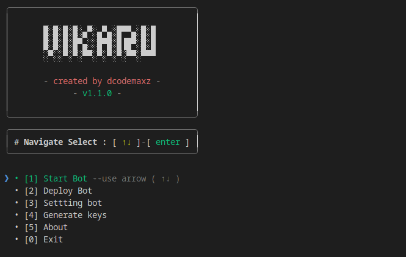

##### Perhatian ( Indonesian )

Jika kamu menggunakan chrome kamu bisa mengetuk titik 3 yang ada di pojok kanan atas lalu pilih opsi "Terjemahkan..."

---

# <div align='center'>Vikaru-Md | WhatsApp Bot Multidevice</div>

<div align="center">


<br/>


<a href="https://chat.whatsapp.com/GlNdk54lm9V7C4U54SXnh1">
    
</a>

<a href="https://github.com/dcodemaxz/Vikaru-Bot/stargazers">
    
</a>
<a href="https://github.com/dcodemaxz/Vikaru-Bot/network/members">
    
</a>


</div>

## # Vikaru-Md | ( install )

- Open your terminal / Ubuntu / [Termux](https://github.com/termux/termux-app/releases/tag/)
- Update your terminal ( opsional )

```
apt update && apt upgrade -y
```

- Install git

```
apt install git -y
```

- Clone Vikaru-Md repo

```
git clone https://github.com/dcodemaxz/vikaru-md.git
```

- Enter repository token ( vip only )
```
xxxxxxxxxxxxx
```

---

## # Vikaru-Md | ( start )

- Enter the file storage directory

```
cd vikaru-md
```

- Start bot

```
node start.js
```

- Enter the WhatsApp number (62: country code)

```
Ex: +62 895-0889-9033
```

- Then copy the pairing code and enter the code via the WhatsApp notification that appears.
- Wait until it enters, then name the device as you wish.

- Then try sending a simple cmd to the bot number

```
/menu
```


---

## Vikaru-Md | ( info )

### [ 1 ] start.js



> Automatically restart the bot if the server closes due to over-limit/error

- 1) Start Normal : The bot will start normally and if there is a fatal error the bot will stop running.
- 2) Start Looping : The bot will start looping and if there is a fatal error the bot will restart automatically.
- 3) Install Update : Updates files directly and will overwrite existing files. Make sure you have backed up other important files such as "database" folders and others.

### [ 2 ] CLI Menu


> Manage sessions in real time while nodejs is running by simply pressing "enter"

- 1) Stop all session : Stops all running bot sessions/numbers
- 2) Add another session : Adding new bot session/number
- 3) Run another session : Run another available session in the session list


### [ 3 ] vikaru-md

Vikaru-Md is a multi-device WhatsApp bot designed to easily meet various needs, including AI, tools, group management, bug management, and business management. This bot offers comprehensive and unique features, such as:

#### • [ Other Features ]

- Pairing code & qr code
- Custom pairing
- CLI Interactive menu
- Whitelist system when index.js is run
- The code is neat and easy to modify
- Multi prefix
- Multi session (can run on multiple numbers)
- Innovative interface/log display
- Anti call
- Anti link grup
- Anti promosi
- Anti Toxic
- Anti bot kidnapping to group
- Anti Virtex/Spam
- Welcome, Leave, promote, and demote messages
- Pushkontak
- Broadcast
- Banned
- Bug / Delay
- Auto vn
- Auto AI

#### • [ Main course ]

- Other Menu
- Ai Menu
- Convert Menu
- Search Menu
- Anime Menu
- Bug Menu
- Tools Menu
- Group Menu
- System Menu

---

## # Script Info

You can buy this script via this [Telegram](https://t.me/dcodemaxz) / [WhatsApp](https://wa.me/6289508899033)

Buyer benefits :

- Get free updates ( No Expired )
- Update every week
- Given guidance to modify
- Guided to be able to develop bots

You can also use and see the bot features via community [group](https://chat.whatsapp.com/JfpGsd5GPh5EzvRVjm54tx)

---

## # Contributing

Feel free to contribute by opening issues or pull requests. Your feedback and contributions are highly appreciated.

---

## # License

This project is licensed under the [MIT License](LICENSE).
