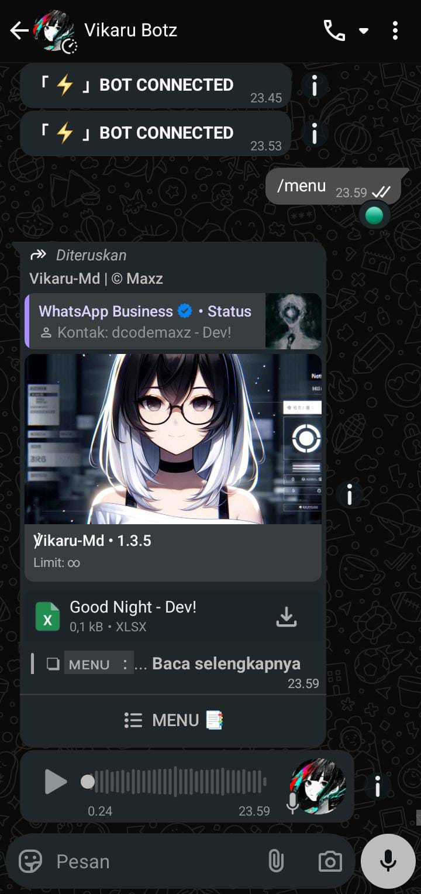
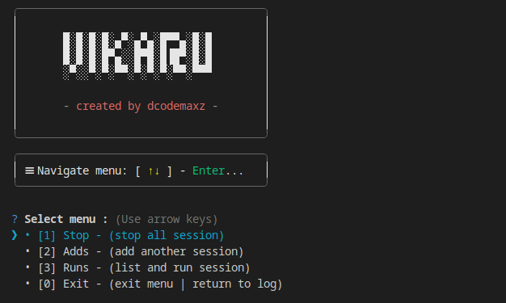
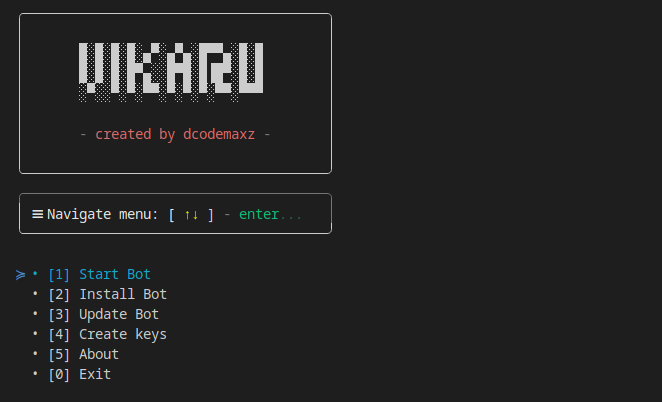

<!-- Wave Header -->
<p align="center">
  
</p>

# <div align='center'>Vikaru-Md | WhatsApp Bot Multidevice</div>

<div align="center">


<br/>

<a href="https://chat.whatsapp.com/GlNdk54lm9V7C4U54SXnh1">
    
</a>

<a href="https://github.com/dcodemaxz/vikaru-bot/stargazers">
    
</a>
<a href="https://github.com/dcodemaxz/vikaru-bot/network/members">
    
</a>


</div>

---

## 🧭 Tentang Vikaru-Md

**Vikaru-Md** adalah WhatsApp Bot **Multi-Device** berbasis Node.js yang dirancang untuk:
- Otomatisasi
- Integrasi AI
- Moderasi grup
- Kebutuhan bisnis

Memiliki arsitektur **clean, modular, dan developer-friendly**, serta mendukung multi-session (menjalankan beberapa bot sekaligus).

> Mulai versi **v2.3.0+**, proses **instalasi, update, dan manajemen bot** telah digabung langsung ke dalam repository ini (tanpa repo terpisah).

---

## ⚙️ Installation (All-in-One)

### 1. Update environment ( Debian / Ubuntu / VPS )

```bash
apt update -y && apt upgrade -y
```

### 2. Install dependencies

#### Linux ( Ubuntu / Debian / VPS )

```bash
sudo apt install -y git bash curl python3 python3-pip ffmpeg && \
curl -fsSL https://deb.nodesource.com/setup_lts.x | sudo bash - && \
sudo apt install -y nodejs && \
sudo wget https://github.com/yt-dlp/yt-dlp/releases/latest/download/yt-dlp -O /usr/local/bin/yt-dlp && \
sudo chmod a+rx /usr/local/bin/yt-dlp && yt-dlp --version
```

#### Termux ( Android / Emulator )

```bash
pkg install -y git bash python nodejs ffmpeg && \
wget https://github.com/yt-dlp/yt-dlp/releases/latest/download/yt-dlp && \
chmod a+rx yt-dlp && mv yt-dlp $PREFIX/bin/ && yt-dlp --version
```

### 3. Clone repository

```bash
git clone https://github.com/dcodemaxz/vikaru-bot.git vikaru
```

---

## 🚀 Getting Started

### 1. Masuk ke direktori project

```bash
cd vikaru
```

### 2. Jalankan launcher

```bash
bash start
```

---

## 🔐 Generate SSH Key ( Verifikasi Lisensi )

Dari menu, pilih:

```
• [3] Generate keys
```

> [!IMPORTANT]
> Salin **public key** yang dihasilkan lalu kirim ke developer untuk aktivasi.

> [!CAUTION]
> ⚠️ Jangan pernah membagikan **private key** (`id_ed25519`).

Kontak developer:
- WhatsApp: https://wa.me/6289508899033
- Telegram: https://t.me/dcodemaxz

---

## ▶️ Start Bot

Dari menu utama:

```
• [1] Deploy Bot
```

Jika bot belum terpasang, sistem akan:
- Install otomatis
- Setup environment

Jika bot sudah ada, akan muncul prompt:

```
[ Y = Update / N = Start ] ?
```

- **Y** → Update bot
- **N** → Langsung menjalankan bot (loop-safe, anti-exit)

Masukkan nomor WhatsApp (format internasional, contoh `+6289508899033`) lalu hubungkan **pairing code** ke WhatsApp Anda.

Setelah sukses, kirim perintah:

```
/menu
```



---

## 🧩 CLI Menu ( Session Manager )



> Kelola session secara real-time saat Node.js berjalan ( tekan **Enter** ).

- **[1] Stop** → Hentikan semua session
- **[2] Adds** → Tambah session WhatsApp baru
- **[3] Runs** → Jalankan session tersimpan

---

## 🤖 Vikaru-Md Bot Core

### ✨ Core Highlights

- Pairing Code & QR Code login
- Custom Pairing ID
- CLI Interactive Menu
- Whitelist system ( index.js )
- Clean & readable codebase
- Multi-prefix support
- Multi-session (multi bot)
- Interactive log viewer
- Anti Call / Anti Spam / Anti Link / Anti Virtex
- Group events ( welcome, leave, promote, demote )
- Broadcast / Push Contact
- Auto AI / Auto VN
- dll / etc

### 📂 Command Categories

- Other Menu
- AI Menu
- Convert Menu
- Search Menu
- Anime Menu
- Tools Menu
- Group Menu
- System Menu

---

## ⬇️ Downloader Features

Vikaru-Md juga berfungsi sebagai **downloader utility**, mendukung:
- YouTube
- Hampir semua media sosial
- Audio / Video

Didukung oleh **yt-dlp** dengan integrasi langsung ke bot.

---

## 💡 Management Features



- **[1] Deploy Bot** → Install / Update / Start otomatis (loop-safe)
- **[2] Settings Bot** → Konfigurasi bot ( owner, dll )
- **[3] About This Bot** → Informasi sistem & kredit

---

## 🛒 Purchase Info

> Pembelian script melalui:
- Telegram: https://t.me/dcodemaxz
- WhatsApp: https://wa.me/6289508899033

**Benefit Pembeli:**
- Lifetime update
- Bantuan modifikasi
- Source code 99% no enc
- Mentoring pribadi build/setup bot

---

## 🤝 Feedback & Issues

> [!IMPORTANT]
> **✅ Boleh:**
> - Report bug ( Issues )
> - Request fitur
> - Saran dokumentasi
>
> **❌ Tidak boleh:**
> - Submit perubahan source code ( proprietary )

Support khusus user berlisensi tersedia via WhatsApp.

---

## 🪪 License

> [!WARNING]
> 🔒 **Proprietary Software License** - [MIT License](LICENSE).

---

<!-- Wave Footer Divider -->


<div align="center">

<p><strong>🌐 Community</strong></p>

<table width="100%" cellspacing="0" cellpadding="10">
<tr>
<td align="center" valign="top">

<!-- Item 1: Group -->
<div style="margin-bottom: 40px; padding: 20px; max-width: 300px;">
  <div style="width: 50px; height: 2px; background: linear-gradient(90deg, transparent, #333, transparent); margin: 10px auto;"></div>
  <br><strong>WhatsApp Group</strong>
  <p style="margin: 10px 0;">Ask questions, share ideas & help</p>
  <div style="width: 50px; height: 2px; background: linear-gradient(90deg, transparent, #333, transparent); margin: 10px auto;"></div>
  <a href="https://chat.whatsapp.com/GlNdk54lm9V7C4U54SXnh1" style="text-decoration: none;">
    
  </a>
</div>

  ---

<!-- Item 2: Channel -->
<div style="margin-bottom: 40px; padding: 20px; max-width: 300px;">
  <div style="width: 50px; height: 2px; background: linear-gradient(90deg, transparent, #333, transparent); margin: 10px auto;"></div>
  <br><strong>WhatsApp Channel</strong>
  <p style="margin: 10px 0;">Official updates & announcements</p>
  <div style="width: 50px; height: 2px; background: linear-gradient(90deg, transparent, #333, transparent); margin: 10px auto;"></div>
  <a href="https://whatsapp.com/channel/0029VbBotdf1noz7cQLbTw45" style="text-decoration: none;">
    
  </a>
</div>

  ---

<!-- Item 3: Review -->
<div style="padding: 20px; max-width: 300px;">
  <div style="width: 50px; height: 2px; background: linear-gradient(90deg, transparent, #333, transparent); margin: 10px auto;"></div>
  <br><strong>Review Tool</strong>
  <p style="margin: 10px 0;">Watch tutorials & feature reviews</p>
  <div style="width: 50px; height: 2px; background: linear-gradient(90deg, transparent, #333, transparent); margin: 10px auto;"></div>
  <a href="https://youtu.be/EeMXJCw2oOo?si=iL_JVrrx7rkjbaYy" style="text-decoration: none;">
    
  </a>
</div>
  
</td>
</tr>
</table>

</div>

<!-- Wave Footer Divider -->


<div align="center">

  <!-- Repobeats Analytics -->
  <p><strong>📊 RepoBeats Analytics</strong></p>
  

---

  <!-- Star History -->
  <p><strong>🌟 Star History</strong></p>
  <a href="https://star-history.com/#dcodemaxz/vikaru-bot&Date">
    
  </a>

  <hr/>

  <p><strong>Copyright | <a href="https://github.com/dcodemaxz">© 2025 - 2026 dcodemaxz</a></strong></p>

<!-- Wave Footer -->
<p align="center">
  
</p>

</div>